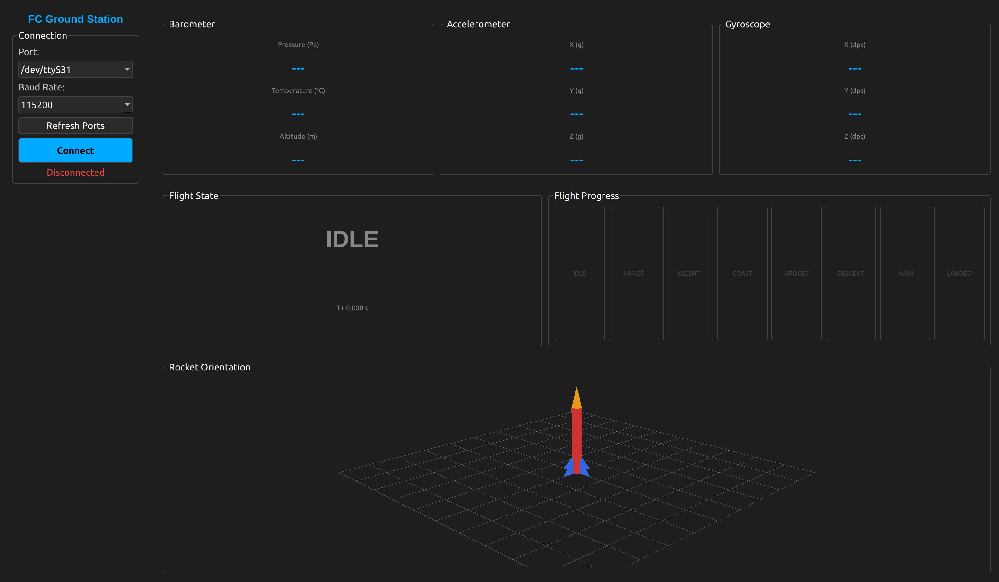

# Ground Station

A desktop application for receiving and displaying live telemetry from any flight computer that implements the TALON-1 packet protocol. Built in Python with PyQt6.

---

## Screenshot



---

## Development Checkpoints

| Checkpoint | Status |
|---|---|
| Binary packet parser | Complete |
| Serial worker background thread | Complete |
| Main window with port and baud selector | Complete |
| Telemetry panel — baro, accel, gyro readouts | Complete |
| Flight state panel with progress indicator | Complete |
| 3D rocket orientation view | Complete |
| LoRa radio receive support | Not Started |
| Kalman filter integration | Not Started |
| GPS display | Not Started |
| Data logging to file | Not Started |

---

## Features

- Serial port and baud rate selection with refresh button
- Live barometer readout — pressure, temperature, altitude
- Live accelerometer and gyroscope readouts
- Flight state display showing current state in colour with a full flight progress indicator
- 3D rocket orientation visualization driven by live gyroscope data
- Compatible with any flight computer that sends the TALON-1 packet format

---

## Project Structure
```
App/
├── main.py                   entry point
├── data_parser.py            binary packet parser
├── comms/
│   ├── __init__.py
│   └── serial_worker.py      background thread for serial reading
└── gui/
    ├── __init__.py
    ├── main_window.py         main application window
    ├── telemetry_panel.py     sensor data readouts
    ├── state_panel.py         flight state display
    └── rocket_view.py         3D orientation visualization
```

---

## Installation

### Requirements

- Python 3.10 or higher
- Linux, Windows, or macOS

### Install Dependencies
```bash
pip install PyQt6 pyserial numpy pyqtgraph PyOpenGL
```

### Run
```bash
python main.py
```

---

## How to Connect

1. Connect the flight computer via USB
2. Launch the application
3. Select the correct serial port from the dropdown (on Linux this will be `/dev/ttyACM0`)
4. Set baud rate to `115200`
5. Click **Connect**

---

## Telemetry Protocol

The application parses binary packets defined in the TALON-1 telemetry protocol. See `Telemetry/README.md` for the full packet specification.

| Parameter | Value |
|---|---|
| Header bytes | 0x07 0x32 |
| Packet size | 44 bytes |
| Byte order | Little endian |
| Baud rate | 115200 |
| Data rate | 20 Hz |

---

## How the Serial Worker Works

Serial data is read in a background thread so the GUI never freezes. The thread continuously reads bytes into a buffer and calls `find_packet()` to scan for valid packets. Each valid packet is passed to the GUI via a Qt signal so the GUI and serial reader run simultaneously without interfering with each other.

---

## 3D Orientation

The rocket orientation is computed by integrating gyroscope data over time. The gyro gives rotation rates in degrees per second. Multiplying by the time between packets gives the change in angle for each axis. A deadband of 0.5 dps is applied to ignore sensor noise when stationary. A Kalman filter will be added in a future update to correct gyroscope drift using accelerometer data.

---

## Dependencies

| Library | Purpose |
|---|---|
| PyQt6 | GUI framework |
| pyserial | Serial port communication |
| numpy | Matrix math for 3D rotation |
| pyqtgraph | 3D OpenGL viewport |
| PyOpenGL | OpenGL backend for pyqtgraph |
